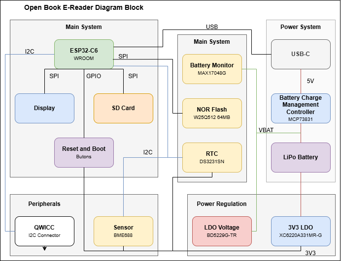

### Copyright Dinca Tudor-Cristian 332CA 2025

# OpenBook E-Reader

1. [Block Diagram](#block-diagram)
2. [Bill of Materials](#bill-of-materials)
3. [Hardware Details](#hardware-functionality)
4. [ESP32-C6 Pins](#ESP32-C6-pin-mapping)

# Block Diagram

---

# Bill of Materials

| Qty | Description                                                                                                                                                                                                                                                                                                                                                                                                                                                                                          | Value                                                                          | Parts                                                                                                   | AVAILABILITY            | CHECK_PRICES                                                                                                                                                                                                                                                                                                                                                                                                                                                                                                                                                                                 | DATASHEET                                                                                                                                                |
| --- | ---------------------------------------------------------------------------------------------------------------------------------------------------------------------------------------------------------------------------------------------------------------------------------------------------------------------------------------------------------------------------------------------------------------------------------------------------------------------------------------------------- | ------------------------------------------------------------------------------ | ------------------------------------------------------------------------------------------------------- | ----------------------- | -------------------------------------------------------------------------------------------------------------------------------------------------------------------------------------------------------------------------------------------------------------------------------------------------------------------------------------------------------------------------------------------------------------------------------------------------------------------------------------------------------------------------------------------------------------------------------------------- | -------------------------------------------------------------------------------------------------------------------------------------------------------- |
| 1   | LED                                                                                                                                                                                                                                                                                                                                                                                                                                                                                                  |                                                                                | CHG_LED                                                                                                 | In Stock                | https://ro.mouser.com/ProductDetail/ams-OSRAM/LB-Q99G.01-P1R1-35-1?qs=IPgv5n7u5QZHWhEkNg3xgA%3D%3D                                                                                                                                                                                                                                                                                                                                                                                                                                                                                           | https://ro.mouser.com/datasheet/2/588/prd_pim_datasheet_23471863_EN_pdf-3317093.pdf                                                                      |
| 1   | SMD solder JUMPER                                                                                                                                                                                                                                                                                                                                                                                                                                                                                    |                                                                                | SJ1                                                                                                     | In Stock                | https://ro.mouser.com/ProductDetail/Vishay-Dale/CRCW04020000Z0EEHP?qs=sGAEpiMZZMtlubZbdhIBIKF%2FTFcY2hSpgvMg4uB1QYw%3D                                                                                                                                                                                                                                                                                                                                                                                                                                                                       | https://www.vishay.com/docs/20043/crcwhpe3.pdf                                                                                                           |
| 1   | CAPACITOR, European symbol                                                                                                                                                                                                                                                                                                                                                                                                                                                                           | 0.1uF/50V                                                                      | EPD_C5                                                                                                  | In Stock                | [https://ro.mouser.com/ProductDetail/Walsin/0402N151F500CT?qs=ZrPdAQfJ6DML0ptnM%2FXFsA%3D%3D&utm_id=6470900573&utm_source=google&utm_medium=cpc&utm_marketing_tactic=emeacorp&gad_source=1&gclid=Cj0KCQjwhr6_BhD4ARIsAH1YdjB1QLZVHFVJAtMd1vwkIhjE6qN7B49LVIzW80TzkBiTwUEhFkgf5tQaAoaREALw_wcB](https://ro.mouser.com/ProductDetail/Walsin/0402N151F500CT?qs=ZrPdAQfJ6DML0ptnM%2FXFsA%3D%3D&utm_id=6470900573&utm_source=google&utm_medium=cpc&utm_marketing_tactic=emeacorp&gad_source=1&gclid=Cj0KCQjwhr6_BhD4ARIsAH1YdjB1QLZVHFVJAtMd1vwkIhjE6qN7B49LVIzW80TzkBiTwUEhFkgf5tQaAoaREALw_wcB) | [https://ro.mouser.com/datasheet/2/210/WTC_MLCC_General_Purpose-1534899.pdf](https://ro.mouser.com/datasheet/2/210/WTC_MLCC_General_Purpose-1534899.pdf) |
| 1   | RESISTOR, European symbol                                                                                                                                                                                                                                                                                                                                                                                                                                                                            | 0.47                                                                           | R3                                                                                                      | In Stock                | https://ro.mouser.com/ProductDetail/Panasonic/ERJ-2BQJR47X?qs=18kBAoNi3c8r%252BkU3FsPM2Q%3D%3D                                                                                                                                                                                                                                                                                                                                                                                                                                                                                               | https://industrial.panasonic.com/cdbs/www-data/pdf/RDN0000/AOA0000C313.pdf                                                                               |
| 1   | RESISTOR, European symbol                                                                                                                                                                                                                                                                                                                                                                                                                                                                            | 100K                                                                           | R1_PWRUSB                                                                                               | In Stock                | [https://ro.mouser.com/ProductDetail/Welwyn-Components-TT-Electronics/WCR0402-100KFA?qs=%2F5Ar%2FAxv93DcWIrqMX6zjw%3D%3D](https://ro.mouser.com/ProductDetail/Welwyn-Components-TT-Electronics/WCR0402-100KFA?qs=%2F5Ar%2FAxv93DcWIrqMX6zjw%3D%3D)                                                                                                                                                                                                                                                                                                                                           | https://ro.mouser.com/datasheet/2/414/TTRB_S_A0012915158_1-2565570.pdf                                                                                   |
| 6   | CAPACITOR, European symbol                                                                                                                                                                                                                                                                                                                                                                                                                                                                           | 100nF                                                                          | C1, C2, C6, C8, C10, C_DELAY                                                                            | In Stock                | https://ro.mouser.com/ProductDetail/KYOCERA-AVX/04023C104KAT2A-62?qs=%252BdQmOuGyFcH%2FNuvX5KIF9Q%3D%3D                                                                                                                                                                                                                                                                                                                                                                                                                                                                                      | https://ro.mouser.com/datasheet/2/40/X7RDielectric-2943470.pdf                                                                                           |
| 2   | CAPACITOR, European symbol                                                                                                                                                                                                                                                                                                                                                                                                                                                                           | 100nF                                                                          | C4_USB, C9                                                                                              | In Stock                | https://ro.mouser.com/ProductDetail/KYOCERA-AVX/04023C104KAT2A-62?qs=%252BdQmOuGyFcH%2FNuvX5KIF9Q%3D%3D                                                                                                                                                                                                                                                                                                                                                                                                                                                                                      | https://ro.mouser.com/datasheet/2/40/X7RDielectric-2943470.pdf                                                                                           |
| 1   | POLARIZED CAPACITOR, European symbol                                                                                                                                                                                                                                                                                                                                                                                                                                                                 | 100uF TANT                                                                     | C3                                                                                                      | In Stock                | https://ro.mouser.com/ProductDetail/KYOCERA-AVX/TCJB106M020R0150E?qs=DPoM0jnrROXN%252B%252BcGKR%2FSYA%3D%3D&srsltid=AfmBOoo1FzSeu9BDfQsWfsf6aT2Nks-cpAUpOlGyrzjX172lod-o8mYB                                                                                                                                                                                                                                                                                                                                                                                                                 | https://ro.mouser.com/datasheet/2/40/TCJ-2887130.pdf                                                                                                     |
| 16  | RESISTOR, European symbol                                                                                                                                                                                                                                                                                                                                                                                                                                                                            | 10K                                                                            | R1, R1_PINH, R1_PINH1, R2-PINH, R2-PINH1, R4, R5, R6, R7, R8, R9, R10, R_BOOT, R_CHANGE, R_CL1, R_RESET | In Stock                | https://ro.mouser.com/ProductDetail/YAGEO/RC0402FR-07100KL?qs=mnq%2FyloZIXzTlUn7JAHSWg%3D%3D                                                                                                                                                                                                                                                                                                                                                                                                                                                                                                 | https://ro.mouser.com/datasheet/2/447/YAGEO_PYu_RC_Group_51_RoHS_L_12-3313492.pdf                                                                        |
| 1   | CAPACITOR, European symbol                                                                                                                                                                                                                                                                                                                                                                                                                                                                           | 10uF                                                                           | C7                                                                                                      | In Stock                | https://ro.mouser.com/ProductDetail/KYOCERA-AVX/KAM05AR71E103KH?qs=Jm2GQyTW%2FbgMbf7pmhTrvw%3D%3D                                                                                                                                                                                                                                                                                                                                                                                                                                                                                            | https://ro.mouser.com/datasheet/2/40/AutoMLCCKAM-3216307.pdf                                                                                             |
| 1   | Micro SD Card Socket, Push-Push Type, Top Mount, SMT, H=1.83mm, 10u                                                                                                                                                                                                                                                                                                                                                                                                                                  | 112A-TAAR-R03_ATTEND                                                           | J4                                                                                                      | In Stock                | https://www.soselectronic.com/ro-ro/products/attend/112a-taar-r03-116052                                                                                                                                                                                                                                                                                                                                                                                                                                                                                                                     | https://cdn.soselectronic.com/productdata/bd/ac/42954337/112a-taar-r03.pdf                                                                               |
| 1   | RESISTOR, European symbol                                                                                                                                                                                                                                                                                                                                                                                                                                                                            | 15                                                                             | R_CAPACITOR                                                                                             | In Stock                | https://ro.mouser.com/ProductDetail/Bourns/CR0402-FX-15R0GLF?qs=sGAEpiMZZMtlubZbdhIBICGkyIRIR3aIuucn1Gj71Hk%3D                                                                                                                                                                                                                                                                                                                                                                                                                                                                               | https://ro.mouser.com/datasheet/2/54/cr-1858361.pdf                                                                                                      |
| 1   | CAPACITOR, European symbol                                                                                                                                                                                                                                                                                                                                                                                                                                                                           | 1uF                                                                            | C5                                                                                                      | In Stock                | https://ro.mouser.com/ProductDetail/TAIYO-YUDEN/MAASL105CC7105MFCA01?qs=HFfMDpzxxd1Fn%2FInbJA7vw%3D%3D                                                                                                                                                                                                                                                                                                                                                                                                                                                                                       | https://ro.mouser.com/datasheet/2/396/TAIYO_YUDEN_04_27_2024_c_mlcc_A_e1-3451516.pdf                                                                     |
| 9   | CAPACITOR, European symbol                                                                                                                                                                                                                                                                                                                                                                                                                                                                           | 1uF/50V                                                                        | EPD_C1, EPD_C2, EPD_C6, EPD_C7, EPD_C8, EPD_C9, EPD_C10, EPD_C11, EPD_C12                               | In Stock                | https://ro.mouser.com/ProductDetail/TAIYO-YUDEN/MAASU32NSB7105KTCA01?qs=sGAEpiMZZMukHu%252BjC5l7YTv8iICJ6%2Fau7q9mUPeDLKU%3D                                                                                                                                                                                                                                                                                                                                                                                                                                                                 | https://ro.mouser.com/datasheet/2/396/TDK_4_24_2024_MAASU32NSB7105KTCA01_SS-3440852.pdf                                                                  |
| 1   | RESISTOR, European symbol                                                                                                                                                                                                                                                                                                                                                                                                                                                                            | 2.2                                                                            | R2                                                                                                      | In Stock                | https://ro.mouser.com/ProductDetail/YAGEO/RC0402JR-072R2L?qs=sGAEpiMZZMtlubZbdhIBIDHZZHtX2mqkbiSU5pja5tk%3D                                                                                                                                                                                                                                                                                                                                                                                                                                                                                  | https://ro.mouser.com/datasheet/2/447/YAGEO_PYu_RC_Group_51_RoHS_L_12-3313492.pdf                                                                        |
| 1   | RESISTOR, European symbol                                                                                                                                                                                                                                                                                                                                                                                                                                                                            | 200                                                                            | R1_BAT                                                                                                  | In Stock                | https://ro.mouser.com/ProductDetail/Panasonic/ERJ-U02D2000X?qs=sGAEpiMZZMtlubZbdhIBICc%2FOdEF9c%2FXmWyuMKnNE4Y%3D                                                                                                                                                                                                                                                                                                                                                                                                                                                                            | https://industrial.panasonic.com/cdbs/www-data/pdf/RDP0000/AOA0000C334.pdf                                                                               |
| 2   | P-channel MOSFETs                                                                                                                                                                                                                                                                                                                                                                                                                                                                                    | 20V/4.2A/52mO/1.4W                                                             | Q1, Q2                                                                                                  | In Stock                | https://ro.mouser.com/ProductDetail/Diodes-Incorporated/DMG2305UX-7?qs=L1DZKBg7t5F%2FNBHrjfxC%252Bg%3D%3D&utm_id=6470900573&utm_source=google&utm_medium=cpc&utm_marketing_tactic=emeacorp&gad_source=1&gclid=Cj0KCQjwhr6_BhD4ARIsAH1YdjDoeyMOZmPtNXLmjl3ngvDMqv7Q8ZoL57iNF_dxsnN5I3NCajG9PIEaAkOEEALw_wcB                                                                                                                                                                                                                                                                                   | https://www.diodes.com/assets/Datasheets/DMG2305UX.pdf                                                                                                   |
| 1   | RESISTOR, European symbol                                                                                                                                                                                                                                                                                                                                                                                                                                                                            | 2K                                                                             | R2_BAT                                                                                                  | In Stock                | https://ro.mouser.com/ProductDetail/Vishay-Dale/CRCW04022K00JNTD?qs=D1%252BtGGlbRE%252BwoJgrHBlX1g%3D%3D                                                                                                                                                                                                                                                                                                                                                                                                                                                                                     | https://www.vishay.com/docs/20008/dcrcw.pdf                                                                                                              |
| 2   | CAPACITOR, European symbol                                                                                                                                                                                                                                                                                                                                                                                                                                                                           | 4.7uF                                                                          | C1_BAT, C2_BAT                                                                                          | In Stock                | https://ro.mouser.com/ProductDetail/KEMET/C0402C475K8PACTU?qs=ulEaXIWI0c9ebKRT3r3htg%3D%3D                                                                                                                                                                                                                                                                                                                                                                                                                                                                                                   | https://ro.mouser.com/datasheet/2/447/KEM_C1006_X5R_SMD-3316465.pdf                                                                                      |
| 3   | CAPACITOR, European symbol                                                                                                                                                                                                                                                                                                                                                                                                                                                                           | 4.7uF                                                                          | C1_BAT1, C1_BAT2, C5_USB                                                                                | In Stock                | https://ro.mouser.com/ProductDetail/KEMET/C0402C475K8PACTU?qs=ulEaXIWI0c9ebKRT3r3htg%3D%3D                                                                                                                                                                                                                                                                                                                                                                                                                                                                                                   | https://ro.mouser.com/datasheet/2/447/KEM_C1006_X5R_SMD-3316465.pdf                                                                                      |
| 1   | CAPACITOR, European symbol                                                                                                                                                                                                                                                                                                                                                                                                                                                                           | 4.7uF/25V                                                                      | C4                                                                                                      | In Stock                | https://ro.mouser.com/ProductDetail/KYOCERA-AVX/CM05X5R475M25AH?qs=MyNHzdoqoQJvFdZaEuclBg%3D%3D                                                                                                                                                                                                                                                                                                                                                                                                                                                                                              | https://ro.mouser.com/datasheet/2/40/CM_Series_e-2835982.pdf                                                                                             |
| 2   | RESISTOR, European symbol                                                                                                                                                                                                                                                                                                                                                                                                                                                                            | 5k1                                                                            | R2-USB, R2-USB1                                                                                         | In Stock                | https://ro.mouser.com/ProductDetail/Vishay-Beyschlag/MCS04020C5101FE000?qs=sGAEpiMZZMvdGkrng054t4QdAY%2FQ0LweI%252Blr2dxb1tw%3D                                                                                                                                                                                                                                                                                                                                                                                                                                                              | https://www.vishay.com/docs/28705/mcx0x0xpro.pdf                                                                                                         |
| 1   |                                                                                                                                                                                                                                                                                                                                                                                                                                                                                                      | 68uH                                                                           | L1                                                                                                      | In Stock                | https://www.digikey.de/en/products/detail/w%C3%BCrth-elektronik/744043680/1638515?srsltid=AfmBOopBgKiLEiasm_81lCn1a11PPzCKGdFMi1JqFSJ8kTFummtD-o78                                                                                                                                                                                                                                                                                                                                                                                                                                           | https://www.we-online.com/components/products/datasheet/744043680.pdf                                                                                    |
| 1   | Voltage Detector with Adjustable Delay Time: CMOS processes are utilized to develop high precision, low current consumption CMOS reset ICs that allow arbitrary setting of the delay time. The extensive lineup includes both Nch Open Drain and CMOS output types in a wide range of detection voltages (from 2.3V to 6.0V, in 0.1V steps), enabling selection of the ideal solution based on customer requirements. In addition, the entire series is of course both lead-free and RoHS-compliant. | BD5229G-TR                                                                     | IC1                                                                                                     | In Stock                | https://ro.mouser.com/ProductDetail/ROHM-Semiconductor/BD5229G-1TR?qs=HoCaDK9Nz5dKF71NR7zdNw%3D%3D&utm_id=6470900573&utm_source=google&utm_medium=cpc&utm_marketing_tactic=emeacorp&gad_source=1&gclid=Cj0KCQjwhr6_BhD4ARIsAH1YdjAIpE6_2POwpfdw6DR7vakM2s_-m0lDV7xt7KL-rvPk8BHaBd_4NeAaAozdEALw_wcB                                                                                                                                                                                                                                                                                          | https://fscdn.rohm.com/en/products/databook/datasheet/ic/power/voltage_detector/bd52xxg-1-e.pdf                                                          |
| 3   |                                                                                                                                                                                                                                                                                                                                                                                                                                                                                                      | BUTTON_CUSYOMV1                                                                | BOOT_BUTTON, CHANGE_BUTTON, RESET_BUTTON                                                                | Restricted Availability | https://ro.mouser.com/ProductDetail/Panasonic/EVQ-P7B01K?qs=Ow%252BOiPmaljGz0yYR%252BWV0ZQ%3D%3D                                                                                                                                                                                                                                                                                                                                                                                                                                                                                             | https://industry.panasonic.com/global/en/downloads/?file_cd=402906&tab=catalog&series_cd=3457                                                            |
| 1   | Cap 0.011F 3.3V 1210 Flat Check availability                                                                                                                                                                                                                                                                                                                                                                                                                                                         | CPH3225A                                                                       | C10_SUPERCAP                                                                                            | Not in stock            | [https://www.snapeda.com/parts/CPH3225A/Seiko+Instruments/view-part/?ref=eda](https://www.snapeda.com/parts/CPH3225A/Seiko+Instruments/view-part/?ref=eda)                                                                                                                                                                                                                                                                                                                                                                                                                                   | https://www.snapeda.com/parts/CPH3225A/Seiko%20Instruments/datasheet/                                                                                    |
| 1   | Real Time Clock Serial 16-Pin SOIC W T/R     Check availability                                                                                                                                                                                                                                                                                                                                                                                                                                      | DS3231SN#                                                                      | U3                                                                                                      | In Stock                | [https://www.snapeda.com/parts/DS3231SN%23/Analog+Devices/view-part/?ref=eda](https://www.snapeda.com/parts/DS3231SN%23/Analog+Devices/view-part/?ref=eda)                                                                                                                                                                                                                                                                                                                                                                                                                                   | https://www.snapeda.com/parts/DS3231SN%23/Analog%20Devices/datasheet/                                                                                    |
| 1   | Check availability                                                                                                                                                                                                                                                                                                                                                                                                                                                                                   | ESP32-C6-WROOM-1-N8                                                            | U2                                                                                                      | In Stock                | [https://www.snapeda.com/parts/ESP32-C6-WROOM-1-N8/Espressif+Systems/view-part/?ref=eda](https://www.snapeda.com/parts/ESP32-C6-WROOM-1-N8/Espressif+Systems/view-part/?ref=eda)                                                                                                                                                                                                                                                                                                                                                                                                             | https://www.snapeda.com/parts/ESP32-C6-WROOM-1-N8/Espressif%20Systems/datasheet/                                                                         |
| 1   | VARISTOR                                                                                                                                                                                                                                                                                                                                                                                                                                                                                             | ESP32C6_VARISTORCN1812                                                         | PFMF.050.1                                                                                              | In Stock                | https://ro.mouser.com/ProductDetail/Schurter/PFMF.050.2?qs=1auRipcfynCums5v1iucSA%3D%3D                                                                                                                                                                                                                                                                                                                                                                                                                                                                                                      | https://ro.mouser.com/datasheet/2/358/typ_PFMF-1275918.pdf                                                                                               |
| 2   | Schottky Barrier Rectifier Diode                                                                                                                                                                                                                                                                                                                                                                                                                                                                     | ESP32_WROVER_AVX---SD0805S020S1R0_AVX_SD0805S020S1R0_0_0AVX_SD0805S020S1R0_0_0 | D2, D7                                                                                                  | In Stock                | https://ro.mouser.com/ProductDetail/KYOCERA-AVX/SD0805S020S1R0?qs=jCA%252BPfw4LHbpkAoSnwrdjw%3D%3D                                                                                                                                                                                                                                                                                                                                                                                                                                                                                           | [http://datasheets.avx.com/schottky.pdf](http://datasheets.avx.com/schottky.pdf)                                                                         |
| 1   | Integrated Environmental Unit                                                                                                                                                                                                                                                                                                                                                                                                                                                                        | ESP32_WROVER_BME680_BME680                                                     | SENSOR2                                                                                                 | In Stock                | https://ro.mouser.com/ProductDetail/Bosch-Sensortec/BME680?qs=v271MhAjFHjo0yA%2FC4OnDQ%3D%3D                                                                                                                                                                                                                                                                                                                                                                                                                                                                                                 | [https://ro.mouser.com/datasheet/2/783/BST_BME680_DS001-1509608.pdf](https://ro.mouser.com/datasheet/2/783/BST_BME680_DS001-1509608.pdf)                 |
| 1   | MCP73831T Li-Ion, Li-Pol Controller                                                                                                                                                                                                                                                                                                                                                                                                                                                                  | ESP32_WROVER_SPARKFUN-IC-POWER_MCP73831                                        | MCP73831                                                                                                | In Stock                | https://ro.mouser.com/ProductDetail/Microchip-Technology/MCP73831T-2DCI-OT?qs=yUQqVecv4qu38ml9qkvsJw%3D%3D                                                                                                                                                                                                                                                                                                                                                                                                                                                                                   | https://ro.mouser.com/datasheet/2/268/MCP73831_Family_Data_Sheet_DS20001984H-3441711.pdf                                                                 |
| 1   |  (0.50mm) Surface Mount, Right Angle                                                                                                                                                                                                                                                                                                                                                                                                                                                                 | FH34SRJ-24S-0.5SH_99_                                                          | J1                                                                                                      | In Stock                | https://ro.mouser.com/ProductDetail/Hirose-Connector/FH34SRJ-24S-0.5SH99?qs=vcbW%252B4%252BSTIpKBl5ap9J8Fw%3D%3D                                                                                                                                                                                                                                                                                                                                                                                                                                                                             | https://ro.mouser.com/datasheet/2/185/FH34SRJ_24S_0_5SH_99__CL0580_1255_6_99_2DDrawing_0-1615044.pdf                                                     |
| 1   | Check availability                                                                                                                                                                                                                                                                                                                                                                                                                                                                                   | MAX17048G+T10                                                                  | U4                                                                                                      | In Stock                | [https://www.snapeda.com/parts/MAX17048G+T10/Analog+Devices/view-part/?ref=eda](https://www.snapeda.com/parts/MAX17048G+T10/Analog+Devices/view-part/?ref=eda)                                                                                                                                                                                                                                                                                                                                                                                                                               | https://www.snapeda.com/parts/MAX17048G+T10/Analog%20Devices/datasheet/                                                                                  |
| 3   | ON SEMICONDUCTOR - MBR0530 - DIODE, SCHOTTKY, 0.5A, 30V, SOD-123                                                                                                                                                                                                                                                                                                                                                                                                                                     | MBR0530                                                                        | D3, D4, D5                                                                                              | In Stock                | [https://www.snapeda.com/parts/MBR0530/Onsemi/view-part/?ref=eda](https://www.snapeda.com/parts/MBR0530/Onsemi/view-part/?ref=eda)                                                                                                                                                                                                                                                                                                                                                                                                                                                           | https://www.snapeda.com/parts/MBR0530/ON%20Semiconductor/datasheet/                                                                                      |
| 6   | Check availability                                                                                                                                                                                                                                                                                                                                                                                                                                                                                   | PGB1010603MR                                                                   | D6, D8, D9, D10, D11, D12                                                                               | In Stock                | [https://www.snapeda.com/parts/PGB1010603MR/Littelfuse/view-part/?ref=eda](https://www.snapeda.com/parts/PGB1010603MR/Littelfuse/view-part/?ref=eda)                                                                                                                                                                                                                                                                                                                                                                                                                                         | https://www.snapeda.com/parts/PGB1010603MR/Littelfuse%20Inc./datasheet/                                                                                  |
| 1   | SparkFun I2C Standard Qwiic Connector                                                                                                                                                                                                                                                                                                                                                                                                                                                                | QWIIC_RIGHT_ANGLE                                                              | J3                                                                                                      | In Stock                | https://ro.mouser.com/ProductDetail/SparkFun/PRT-14417?qs=wd5RIQLrsJhgdz%2FpmZ%2F3GQ%3D%3D                                                                                                                                                                                                                                                                                                                                                                                                                                                                                                   | https://ro.mouser.com/datasheet/2/813/Qwiic_Connector_Datasheet-1223982.pdf                                                                              |
| 1   | CONN USB 2.0 TYPE-C R/A SMT                                                                                                                                                                                                                                                                                                                                                                                                                                                                          | SAMACSYS_PARTS_USB4110-GF-A                                                    | J2                                                                                                      | In Stock                | https://ro.mouser.com/ProductDetail/GCT/USB4110-GF-A?qs=KUoIvG%2F9IlYiZvIXQjyJeA%3D%3D                                                                                                                                                                                                                                                                                                                                                                                                                                                                                                       | https://ro.mouser.com/datasheet/2/837/GCT_USB4110_Product_Drawing___20k_cycles-3455479.pdf                                                               |
| 1   | MOSFET N-Ch 30V 1.5A TrenchFET SC70 Vishay Si1308EDL-T1-GE3 N-channel MOSFET Transistor, 1.5 A, 30 V, 3-Pin SC-70                                                                                                                                                                                                                                                                                                                                                                                    | SI1308EDL-T1-GE3                                                               | Q3                                                                                                      | In Stock                | [https://www.snapeda.com/parts/SI1308EDL-T1-GE3/Vishay+Siliconix/view-part/?ref=eda](https://www.snapeda.com/parts/SI1308EDL-T1-GE3/Vishay+Siliconix/view-part/?ref=eda)                                                                                                                                                                                                                                                                                                                                                                                                                     | https://www.snapeda.com/parts/SI1308EDL-T1-GE3/Vishay%20Siliconix/datasheet/                                                                             |
| 17  | Test pad                                                                                                                                                                                                                                                                                                                                                                                                                                                                                             | TPTP20R                                                                        | TP1, TP2, TP3, TP4, TP5, TP6, TP7, TP8, TP9, TP10, TP11, TP12, TP13, TP14, TP15, TP16, TP17             |                         | Custom                                                                                                                                                                                                                                                                                                                                                                                                                                                                                                                                                                                       | Custom                                                                                                                                                   |
| 1   | Low Cap. ESD Protection Auto SOT-23-6 STMicroelectronics USBLC6-2SC6Y, Dual Uni-Directional TVS Diode Array, 6-Pin SOT-23                                                                                                                                                                                                                                                                                                                                                                            | USBLC6-2SC6Y                                                                   | D1                                                                                                      | In Stock                | [https://www.snapeda.com/parts/USBLC6-2SC6Y/STMicroelectronics/view-part/?ref=eda](https://www.snapeda.com/parts/USBLC6-2SC6Y/STMicroelectronics/view-part/?ref=eda)                                                                                                                                                                                                                                                                                                                                                                                                                         | https://www.snapeda.com/parts/USBLC6-2SC6Y/STMicroelectronics/datasheet/                                                                                 |
| 1   | Check availability                                                                                                                                                                                                                                                                                                                                                                                                                                                                                   | W25Q512JVEIQ                                                                   | U1                                                                                                      | In Stock                | [https://www.snapeda.com/parts/W25Q512JVEIQ/Winbond+Electronics/view-part/?ref=eda](https://www.snapeda.com/parts/W25Q512JVEIQ/Winbond+Electronics/view-part/?ref=eda)                                                                                                                                                                                                                                                                                                                                                                                                                       | https://www.snapeda.com/parts/W25Q512JVEIQ/Winbond%20Electronics/datasheet/                                                                              |
| 1   | LDO Voltage Regulators                                                                                                                                                                                                                                                                                                                                                                                                                                                                               | XC6220A331MR-G                                                                 | IC4                                                                                                     | In Stock                | https://ro.mouser.com/ProductDetail/Torex-Semiconductor/XC6220A331MR-G?qs=AsjdqWjXhJ8ZSWznL1J0gg%3D%3D                                                                                                                                                                                                                                                                                                                                                                                                                                                                                       | https://ro.mouser.com/datasheet/2/760/xc6220-3371556.pdf                                                                                                 |

---

# Hardware Functionality

### Microcontroller - ESP32-C6
- **Interfaces:** SPI, I2C, GPIO, USB, PWM
- **Functions:** Wi-Fi/BLE communication, display control, sensor reading, user interface, power management
- **Operating Voltage:** 3.3V

### 1. E-Paper Display (Waveshare WSH-13187 7.5" / SPI)
- **Resolution:** 800x480
- **Interface:** SPI + GPIO  
  - **CS, DC, RST, BUSY**
- **Connected via dedicated header**

### 2. BME688 Sensor (Bosch)
- **Measures:** temperature, pressure, humidity, air quality
- **Interface:** I2C
- **Address:** configurable (default 0x76)
- **Operating Voltage:** 3.3V

### 3. RTC - DS3231SN
- **Function:** Real-Time Clock with supercapacitor backup
- **Interface:** I2C
- **Backup:** 1F Supercapacitor
- **Accuracy:** ±2ppm

### 4. Power Supply
- **Battery:** 2500mAh Li-Po
- **Charging IC:** MCP73831 (linear charger, 3.7V battery)
- **LDO Regulator:** 3.3V (AMS1117 or equivalent)
- **Connector:** USB-C (with ESD protection)

### 5. Battery Management
- **Fuel Gauge:** MAX17048
- **I2C, enables battery level monitoring**

### 6. SD Card
- **Interface:** SPI
- **Usage:** e-book storage

### 7. User Interface
- **RESET Button**
- **3 Input Buttons connected to GPIO + RC debouncing**
- **Functions:** menu navigation, page switching, simple interactions

### 8. Qwiic / Stemma QT Connector
- **Allows easy expansion with external I2C sensors**

---

## 🔋 Battery & Power Usage Summary

### 📦 Battery Capacity
- **2500mAh @ 3.7V = 9.25Wh**

---

### ⚡ Power Consumption Overview

| Mode                | Current Draw | Power (W) | Battery Life       |
|---------------------|--------------|-----------|---------------------|
| 🔘 Idle (Deep Sleep) | ~0.05 mA     | ~0.0002 W | ~5.7 years          |
| 😴 Light Sleep       | ~1.2 mA      | ~0.0044 W | ~86 days            |
| 📖 Active Reading    | ~77 mA       | ~0.285 W  | ~32 hours           |
| 🌐 Wi-Fi Active      | ~177 mA      | ~0.655 W  | ~14 hours           |

---

# ESP32-C6 Pin Mapping

| **ESP32-C6 Pin** | **Net Label**  | **Function**       | **Connected Component**      | **Purpose / Description**                                                                 |
|------------------|----------------|--------------------|-------------------------------|-------------------------------------------------------------------------------------------|
| EN               | RESET          | Enable             | ESP32-C6                      | Main reset input to the microcontroller                                                   |
| IO0              | INT_RTC        | GPIO (Interrupt)   | RTC DS3231SN                  | Receives interrupt signal from RTC (e.g. alarm trigger)                                  |
| IO1              | 32KHZ          | GPIO (Clock In)    | RTC DS3231SN                  | 32kHz clock output from RTC                                                               |
| IO2              | MISO           | SPI MISO           | SD Card                       | Receives data from SD card                                                                |
| IO3              | EPD_BUSY       | GPIO (Input)       | E-Paper Display               | Indicates when the E-Paper display is busy                                               |
| IO4              | SS_SD          | SPI CS             | SD Card                       | Chip select for SD card                                                                   |
| IO5              | EPD_CS         | SPI CS             | E-Paper Display               | Chip select for E-Paper display                                                           |
| IO6              | SCK            | SPI Clock          | E-Paper Display, SD Card      | Clock signal for shared SPI bus                                                           |
| IO7              | MOSI           | SPI MOSI           | E-Paper Display, SD Card      | Sends data to display and SD card                                                         |
| IO8              | GPIO9          | GPIO               | General Purpose               | Spare GPIO or future expansion                                                            |
| IO9              | IO/BOOT        | GPIO / Boot        | Boot Button                   | Used for flashing the ESP32 (held LOW on boot to enter flash mode)                       |
| IO10             | EPD_CS         | SPI CS             | E-Paper Display               | Redundant label for CS (appears twice in schematic)                                       |
| IO11             | FLASH_CS       | SPI CS             | External NOR Flash            | Chip select for SPI flash                                                                 |
| IO12             | USB_D-         | USB D-             | USB-C Connector               | Native USB communication                                                                 |
| IO13             | USB_D+         | USB D+             | USB-C Connector               | Native USB communication                                                                 |
| IO15             | IO/CHANGE      | GPIO               | General Purpose / Input       | Connected to a user-defined I/O (possibly an interrupt line or button)                   |
| IO16             | TX             | UART TX            | Serial Communication          | Transmit line for UART debugging                                                          |
| IO17             | RX             | UART RX            | Serial Communication          | Receive line for UART debugging                                                           |
| IO18             | RTC_RST        | GPIO               | RTC DS3231SN                  | Allows resetting the RTC externally                                                       |
| IO19             | I2C_PW         | GPIO (Power Ctrl)  | I2C Peripherals               | Enables power to I2C devices (BME688, MAX17048, etc.)                                     |
| IO20             | EPD_3V3_C      | GPIO (Power Ctrl)  | E-Paper Display               | Powers the EPD circuit via transistor / switch                                            |
| IO21             | SDA            | I2C Data           | BME688, RTC, MAX17048         | Shared data line for I2C peripherals                                                      |
| IO22             | SCL            | I2C Clock          | BME688, RTC, MAX17048         | Shared clock line for I2C peripherals                                                     |
| IO23             | EPD_RSR        | GPIO               | E-Paper Display               | Reset line for E-Paper display                                                            |
| 3V3              | 3V3            | Power              | All Components                | Main power rail (3.3V)                                                                    |
| GND              | GND            | Ground             | All Components                | Ground reference for the entire system                                                    |

---
